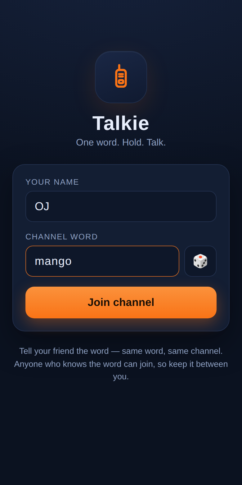
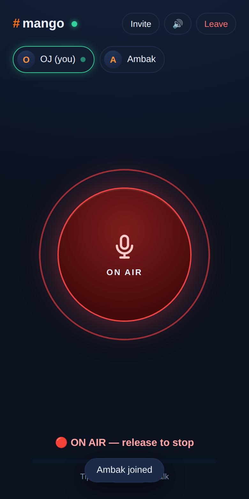
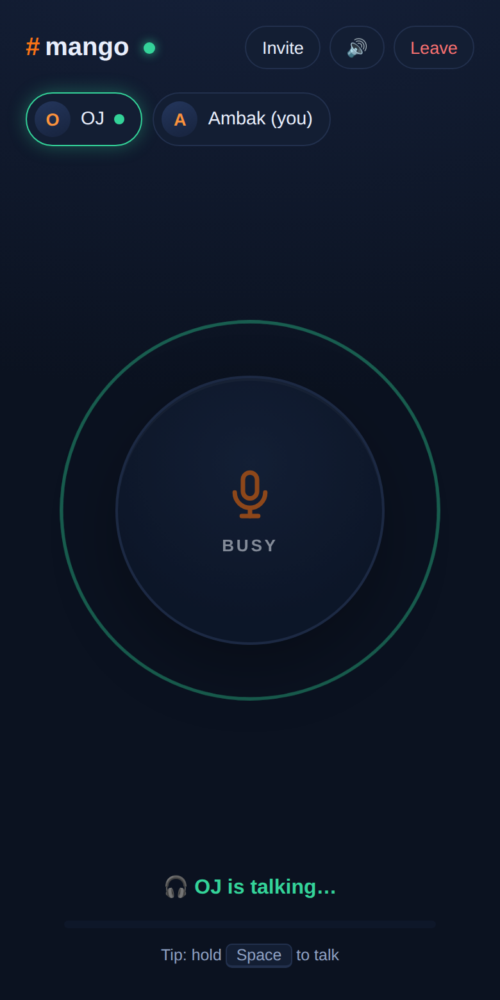

# Talkie 🎙️

A walkie-talkie in your browser. One word to join, hold to talk.

You pick a channel word (say, `mango`), your friend types the same word on
their phone or laptop, and you have a private push-to-talk channel over the
internet. No accounts, no apps to install — it's a web app / PWA you can add
to your home screen.

| Join | On air | Receiving |
|---|---|---|
|  |  |  |

## Features

- **One-word channels** — same word, same channel. Share as a word or a link
  (`https://your-host/mango`). 🎲 suggests a random word.
- **Real walkie-talkie floor control** — one speaker at a time. If someone's
  talking, your button buzzes "channel busy". Roger beep when they finish.
- **Hold to talk** — press-and-hold the big button on mobile, or hold
  <kbd>Space</kbd> on desktop.
- **Works over the internet** — audio is relayed through the server over a
  WebSocket, so it works across any networks/NAT (unlike raw peer-to-peer).
- **PWA** — installable on iOS/Android home screens, offline app shell,
  screen wake-lock while on a channel.
- **Speed roast 🚦** — optional: share location and whoever rides past
  the channel's speed limit triggers *"bhencho bhencho {name}! dheere
  chala!"* plus horn beeps on **everyone's** phone. Hold the 🎤 pill to
  record the line in your own voice — up to **four recordings rotate**
  as extra voices (anyone on the channel can add one; a fifth replaces
  the oldest), synced to late joiners, with TTS calling out the
  culprit's name at the end of a recorded clip. The 🚦 button cycles the limit
  (20/30/40/60/80/100/120/off) and it's **channel-wide**: anyone's
  change syncs to all, new joiners inherit it, and the server enforces
  it. Everyone's live speed shows next to their name in the roster
  (red when over the limit). Privacy: GPS coordinates never leave the
  phone — only the km/h number is shared with your channel.
- **Resilient** — auto-reconnect with backoff, dead-connection watchdog,
  stuck-speaker timeout, per-client rate limiting.
- **Zero frontend dependencies, one backend dependency** (`ws`).

## Run it locally

```bash
npm install
npm start          # → http://localhost:3000
```

Open two tabs, join the same word, hold Space in one. (Mic works on
`localhost` without HTTPS.)

## Put it on the internet

The server is a single small Node process; any Node host works. Two easy
paths:

### Render (free tier) — works from a phone

One-tap (uses the `render.yaml` blueprint at the repo root):

> **[Deploy to Render](https://render.com/deploy?repo=https://github.com/imojbaba/talkie2)** — sign in with GitHub, approve, done.

Or manually:

1. [dashboard.render.com](https://dashboard.render.com) → **New → Web Service** → connect this repo.
2. Build command `npm install`, start command `npm start`. Instance type: Free.
3. Deploy. You get `https://your-app.onrender.com` — HTTPS included, which
   the mic requires.

Note: free instances sleep after ~15 min idle; the first visit after that
takes ~30–60 s to wake. Fine for friends, annoying for daily use — the
cheapest paid tier removes it.

### Docker (Fly.io, Railway, a VPS, anything)

```bash
docker build -t talkie .
docker run -p 3000:3000 talkie
```

Put HTTPS in front (the platform usually does this for you). The mic API
requires a secure context.

### Quick test from your own machine

Any HTTPS tunnel works for a quick session without deploying, e.g.
`cloudflared tunnel --url http://localhost:3000` (or ngrok). Send your friend
the printed URL plus your channel word.

## How it works

```
phone A                      server                       phone B
  mic ─ AudioWorklet          Node + ws                    Web Audio
  16 kHz PCM frames ──ws──▶  floor control  ──ws──▶  jitter buffer ─ speaker
       hold = request floor · release = free it · one speaker at a time
```

- Capture: `getUserMedia` → `AudioWorklet` resamples to 16 kHz mono Int16,
  20 ms frames (~32 KB/s while talking, nothing when idle).
- Transport: binary WebSocket frames tagged with a transmission id; JSON for
  control (join/roster/grant/deny/end).
- The server grants the floor to one speaker per channel, relays their audio
  to everyone else, and force-releases after 5 s of silence (crash safety).
- Playback: Web Audio with a ~120 ms jitter buffer. Mouth-to-ear latency is
  typically 200–400 ms — walkie-talkie territory, by design.
- PCM instead of a codec keeps every moving part dependency-free and works
  in every modern browser including iOS Safari.

## Privacy & limits

- Audio is **relayed, never stored** — the server holds no recordings, no
  accounts, no history. TLS protects it in transit when you host with HTTPS.
- A channel word is a *convenience*, not a secret handshake: anyone who
  guesses the word can join and listen. Use an odd word or `two-words-2024`
  style codes for more privacy; the roster always shows who's on.
- Channels hold up to 16 people (`MAX_ROOM_SIZE` env var to change).

## Phone notes & troubleshooting

- **Mic won't turn on?** You still join in listen-only mode, and the big
  button becomes **"TAP TO ENABLE MIC"** — tapping it re-asks for
  permission and shows tailored help if the browser has it hard-blocked.
- **Opened the link from WhatsApp/Instagram/etc.?** Those in-app browsers
  often block microphones entirely. Use ⋮ (or the share icon) →
  **"Open in browser"** — the app detects this case and says so, with a
  copy-link button.
- **Too quiet?** Audio deliberately avoids the phone-call earpiece route
  (no echo-cancellation constraint — PTT is half-duplex so it isn't
  needed) and plays through the loudspeaker with a volume-boosting
  limiter. Use the volume keys *while audio is playing* to raise media
  volume.
- **Phone calls override Talkie**: when a normal/WhatsApp call (or the
  camera, or any app that takes the phone's audio) starts, Talkie goes
  **on hold** — no playback, no roasts, no transmitting — and resumes
  by itself when the call ends or you come back.
- **Backgrounding**: phones freeze web pages in the background — no web
  app can keep receiving with the screen off (that's native-app
  territory). Talkie holds a screen wake lock while you're on a channel
  (leave it face-up like a real radio) and reconnects instantly when you
  return.
- **iOS**: use Safari; "Add to Home Screen" works on iOS 16.4+.
- If the site isn't HTTPS (or localhost), browsers refuse the mic — the
  app shows a banner instead of failing silently.

## Development

```bash
npm test           # WebSocket protocol tests (node:test)
npm run test:e2e   # two headless Chromium pages actually talking to each other
npm run icons      # regenerate PWA icons (pure-node PNG writer, no deps)
```

The e2e test uses Chromium's fake-mic mode and asserts real audio frames
arrive with non-zero energy on the receiving page.
